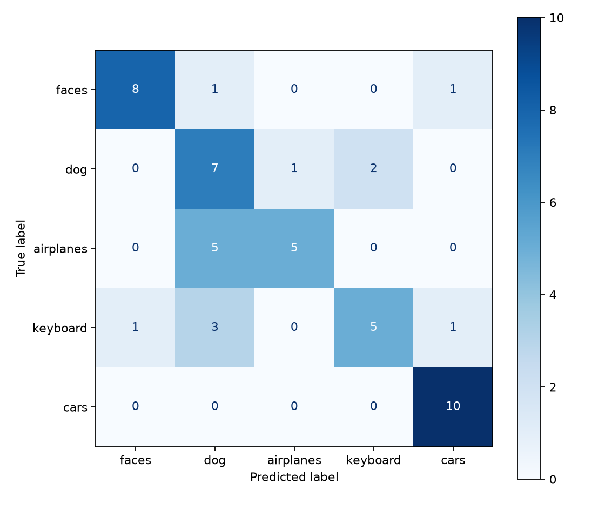

# PyTorch Image Classification CNN

A compact, reproducible PyTorch project for training and evaluating a convolutional
neural network on a five-class image dataset. It includes configurable training,
learning-rate experiments, checkpointing, confusion-matrix generation, and qualitative
prediction visualizations.

The repository contains source code only. Datasets, model weights, local environments,
and submission materials are intentionally excluded.

## Features

- Small CNN with batch normalization and configurable output classes
- Folder-based train/test datasets
- Reproducible training with deterministic random seeds
- Optional horizontal-flip augmentation and weight decay
- Batch learning-rate experiments
- Classification reports, confusion matrices, and prediction examples
- Lightweight unit tests that do not require the dataset

## Project structure

```text
.
|-- src/image_classifier/   # package source
|-- tests/                  # dataset-free unit tests
|-- docs/                   # data layout and usage notes
|-- results/                # non-sensitive example metrics and plots
|-- pyproject.toml
|-- requirements.txt
`-- LICENSE
```

## Installation

Python 3.10 or newer is recommended.

```bash
python -m venv .venv
# Windows: .venv\Scripts\activate
# macOS/Linux: source .venv/bin/activate
python -m pip install -e ".[dev]"
```

## Dataset layout

Prepare your own licensed dataset using this structure:

```text
data/
|-- train/
|   |-- airplanes/
|   |-- cars/
|   |-- dog/
|   |-- faces/
|   `-- keyboard/
`-- test/
    |-- airplanes/
    |-- cars/
    |-- dog/
    |-- faces/
    `-- keyboard/
```

Supported image formats are JPEG, PNG, BMP, and WebP. See
[`docs/data-format.md`](docs/data-format.md) for details.

## Quick start

Validate the model and dataset:

```bash
image-classifier-validate --data-root data
```

Train one model:

```bash
image-classifier-train --data-root data --learning-rate 0.001 --epochs 20
```

Run the learning-rate sweep:

```bash
image-classifier-experiments --data-root data --epochs 20
```

Evaluate a checkpoint:

```bash
image-classifier-evaluate outputs/cnn_lr_0.001.pt --data-root data
```

Generate a grid of correct and incorrect predictions:

```bash
image-classifier-examples outputs/cnn_lr_0.001.pt --data-root data
```

All generated checkpoints and plots are written to `outputs/`, which is ignored by Git.

## Example results

On the original five-class experimental dataset, a learning rate of `1e-4` reached 70%
test accuracy without augmentation and 76% with horizontal-flip augmentation. These
figures are illustrative; performance will vary with the dataset and split.



## Tests

```bash
pytest
```

## Privacy and security

Do not commit datasets containing personal images unless you have explicit permission and
an appropriate license. Keep secrets in environment variables, never in source files.
See [`SECURITY.md`](SECURITY.md) for reporting security issues.

## License

The source code is available under the [MIT License](LICENSE). No license is granted for
third-party datasets or images; obtain and follow their original terms separately.
